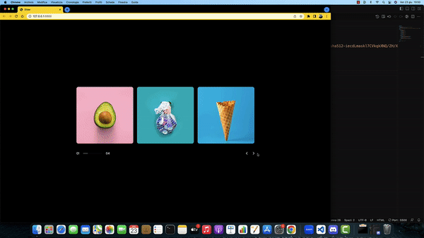

# Frontenders Community

## Challenge #15 - Responsive Slider



In questa challenge bisogna implementare uno slider responsivo. In particolare:
- è possibile navigare avanti e indietro con i controlli in basso a destra
- la navigazione è ciclica: arrivati alla fine e cliccando avanti si ricomincia da capo; dall'inizio, cliccando indietro, si torna alla fine
- in basso a sinistra sono presenti gli indicatori di pagina
- all'hover su una slide è presente un effetto di hover e deve essere mostrato un popup in overlay sulla slide
- in base alla larghezza della viewport vengono mostrate 3, 2 o 1 slide

#### Bonus
- navigazione automatica delle slide ogni tot secondi
- visualizzare una modale di dettaglio al click sul popup di una slide

### Scaffolding
All'interno di ```/assets/images``` sono presenti delle immagini sample per le slide, ma potete usarne anche altre.

### Tecnologie
Per apprezzare a pieno la sfida della challenge è consigliato l'utilizzo di HTML e CSS custom con JavaScript plain, senza librerie di appoggio.

### Credits
La challenge è ispirata da [questo template](https://themeforest.net/item/edrea-personal-portfolio-template/22535185) realizzato da Marketify.